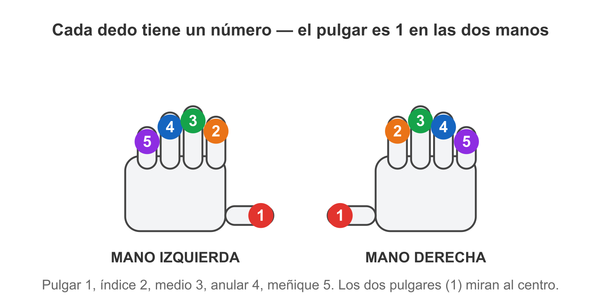
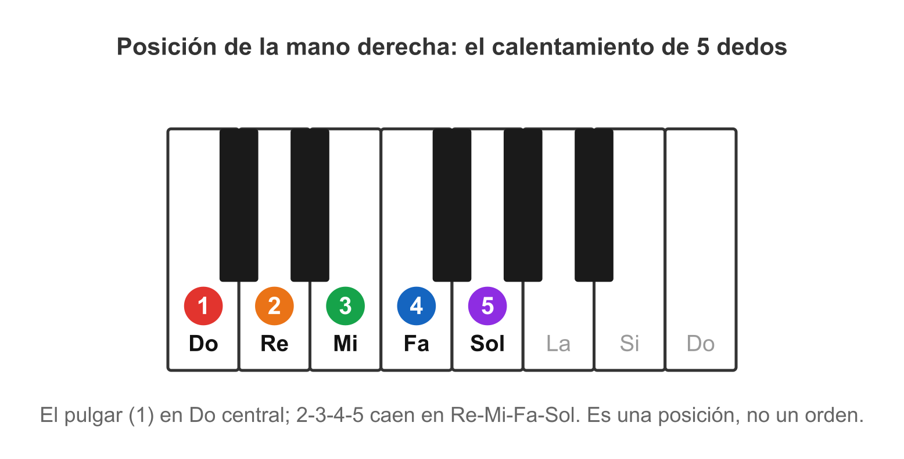

# 🖐️ Los dedos y las manos: el sistema de numeración

> **En el piano cada dedo tiene un número del 1 al 5, igual en las dos manos: el pulgar es 1, el índice 2, el medio 3, el anular 4 y el meñique 5.**
> Cuando yo diga "con el 1 y el 3", ya sabrás exactamente qué dedos. Es un código universal — todos los pianistas lo usan.

```
        MANO IZQUIERDA              MANO DERECHA
         5  4  3  2  1              1  2  3  4  5
       meñ an med ind pul        pul ind med an meñ
```

Ojo al detalle que confunde a todos al inicio: **el pulgar siempre es 1 en ambas manos.** Así que en la mano izquierda los números van del meñique (5) al pulgar (1) de izquierda a derecha, y en la derecha al revés. No lo memorices a la fuerza; con tocar se vuelve natural.


*Mismo código en las dos manos: pulgar 1, índice 2, medio 3, anular 4, meñique 5. Los pulgares miran al centro.*

## 🖐️ El calentamiento de 5 dedos

> **Es el ejercicio de entrada de cada sesión: pones los 5 dedos en 5 teclas blancas seguidas y los tocas uno por uno, subiendo y bajando, despacio.**
> No es para "tocar una canción" — es para despertar la mano y soltar los dedos, como estirar antes de correr.

En la práctica: mano derecha, pulgar (1) en **Do central**, y los dedos 2-3-4-5 caen naturalmente en **Re, Mi, Fa, Sol**. Tocas Do-Re-Mi-Fa-Sol (subiendo) y Sol-Fa-Mi-Re-Do (bajando), una nota por dedo, lento y parejo. Luego lo mismo con la izquierda.


*Pulgar (1) en Do central; 2-3-4-5 caen solos en Re-Mi-Fa-Sol. Esa es la posición.*

Es corto (unos minutos) y es también un **ritual**: marca "empieza la sesión", ayuda a entrar en modo concentración.

## 🖐️ Qué significa "manos separadas"

> **"Manos separadas" quiere decir: practica primero una mano sola hasta que fluya, después la otra sola, y solo entonces las dos juntas. Nunca las dos juntas desde el principio en algo nuevo.**

Esta es **la regla más importante de cómo se practica**, y saltársela es la causa #1 de frustración del principiante. Tu cerebro no puede aprender dos cosas nuevas a la vez (qué hace la derecha + qué hace la izquierda) sin saturarse. Separadas, cada mano aprende su parte tranquila; juntas, solo las coordinas cuando cada una ya sabe lo suyo.

Lo verás escrito así en la ruta: **"manos separadas → juntas"**. Significa ese orden, siempre: derecha sola ✔, izquierda sola ✔, recién ahí juntas.

> 📋 **Repaso en una pantalla**
> - Dedos numerados **1-5**, pulgar = 1 en **las dos manos**.
> - **Calentamiento de 5 dedos** = tocar 5 teclas seguidas dedo por dedo, subiendo y bajando, lento. Despierta la mano y abre la sesión.
> - **Manos separadas → juntas** = una mano sola hasta que fluya, luego la otra, recién después juntas. Nunca las dos de golpe en algo nuevo. (Causa #1 de frustración si te lo saltas.)

> 🎹 **Ahora al teclado:** pon el pulgar derecho (1) en Do central y haz el calentamiento de 5 dedos: Do-Re-Mi-Fa-Sol subiendo, Sol-Fa-Mi-Re-Do bajando. Lento, una nota por dedo. Luego la mano izquierda. Ve a hacerlo antes de seguir.

---
[[02_cifrado|← El cifrado]] · [[00_indice|índice]] · [[04_acorde-mayor|siguiente → El acorde mayor]]
