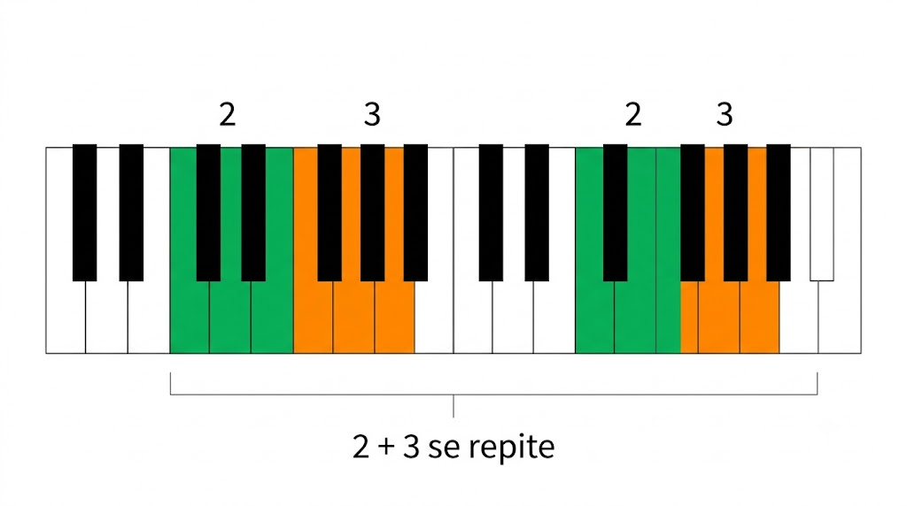
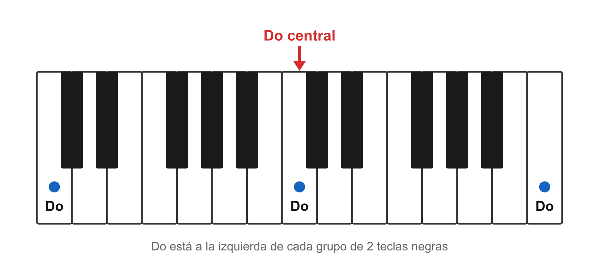
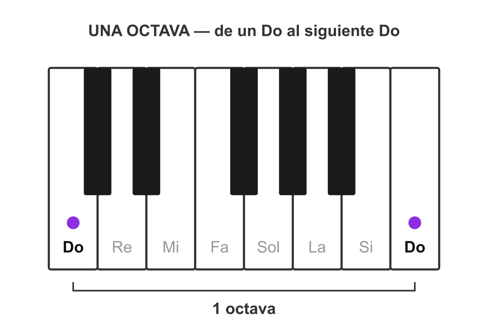

# 🎹 El teclado: cómo orientarte sin perderte

> **El teclado parece un mar de teclas iguales, pero tiene un mapa escondido: las teclas negras vienen en grupos de 2 y de 3, y ese patrón se repite igual por todo el piano.**
> Una vez que ves el patrón, encontrar cualquier nota es fácil. Sin el patrón, todo es adivinar.

Mira tu Casio. No te fijes en las blancas todavía — mira las **negras**. ¿Ves que no están repartidas parejas? Van así, una y otra vez de izquierda a derecha:

```
  ██ ██     ██ ██ ██     ██ ██     ██ ██ ██
 │  │  │  │  │  │  │  │  │  │  │  │  │  │  │  │ ...
 grupo de 2   grupo de 3   grupo de 2   grupo de 3
```

**Grupo de 2 negras, luego grupo de 3, luego de 2, luego de 3...** hasta el final. Ese es el mapa. Todo se ubica respecto a esos grupos.


*Las negras nunca están parejas: 2, luego 3, y vuelta a empezar. Ese es todo el mapa.*

## 🎵 Dónde está Do

> **Do es la tecla blanca que está justo a la izquierda de cada grupo de 2 teclas negras.**
> Hay muchos Do en el teclado (uno por cada grupo de 2), y todos se llaman igual.

Pon el dedo en cualquier grupo de **2 negras**. La blanca pegadita a la izquierda de ese grupo es **Do**. Siempre. No importa en qué parte del piano estés: 2 negras → la blanca de su izquierda es Do.

El **Do central** es simplemente el Do que queda más o menos **en el medio** del teclado (suele estar cerca del logo o la marca del fabricante). Es el punto de referencia desde donde empezamos casi todo, porque queda cómodo para las dos manos.


*Do siempre es la blanca pegada a la izquierda de un grupo de 2 negras. El central es tu punto de partida.*

## 🎵 Las 7 notas

> **Solo existen 7 nombres de notas, y se repiten: Do · Re · Mi · Fa · Sol · La · Si. Después de Si vuelve Do y empieza otra vez.**

Desde un Do, subiendo por las **blancas** hacia la derecha, las notas van en orden:

```
Do · Re · Mi · Fa · Sol · La · Si · (Do otra vez) ...
```

No hay nota número 8: después de Si, el ciclo reinicia en Do. Por eso con 7 nombres alcanza para todo el teclado.

## 🎵 Las teclas negras también tienen nombre (sostenido ♯ y bemol ♭)

> **Las negras se nombran a partir de la blanca vecina: sostenido (♯) sube un pasito a la negra de la derecha; bemol (♭) baja un pasito a la negra de la izquierda. Por eso una misma tecla negra tiene dos nombres.**

Las blancas ya las nombraste (Do-Re-Mi-Fa-Sol-La-Si). Las **negras** se nombran así:

- **Sostenido ♯ = subir** a la negra de la **derecha**. La negra a la derecha de Do es **Do♯** (Do sostenido).
- **Bemol ♭ = bajar** a la negra de la **izquierda**. La negra a la izquierda de Mi es **Mi♭** (Mi bemol).

Y el truco que confunde a todos: **la misma tecla negra tiene dos nombres**, según desde qué blanca la mires.

| Tecla negra | Subiendo (♯) | Bajando (♭) |
|-------------|:------------:|:-----------:|
| entre Do y Re | Do♯ | Re♭ |
| entre Re y Mi | Re♯ | **Mi♭** |
| entre Fa y Sol | Fa♯ | Sol♭ |
| entre Sol y La | Sol♯ | La♭ |
| entre La y Si | La♯ | Si♭ |

> Por eso, cuando en la nota 04 veas **Mi♭**, es simplemente la **tecla negra justo a la izquierda de Mi**. (Misma tecla que Re♯.)

## 🎵 Qué es una octava

> **Una octava es la distancia de un Do al siguiente Do (o de cualquier nota a la siguiente con el mismo nombre). Suenan "igual pero más agudo o más grave".**

Toca un Do, y luego el siguiente Do hacia la derecha. ¿Oyes que es "la misma nota" pero más aguda? Esa distancia es una **octava**. Cuando yo te diga *"una octava más abajo"*, significa: el mismo nombre de nota, pero en el grupo de teclas anterior (hacia la izquierda, más grave).

> 💡 **Agudo/grave = derecha/izquierda (y por qué "altas y bajas").** Hacia la **derecha** las notas son más **agudas** (lo que solemos llamar "altas": suenan finitas, como un silbido). Hacia la **izquierda**, más **graves** ("bajas": suenan gruesas, como un trueno). Por eso *"una octava más abajo"* = a la izquierda. **Ojo:** en música "alto/bajo" describe qué tan aguda es una nota, **no** el volumen — lo fuerte o suave es otra cosa (se dice *fuerte/suave*).


*De un Do al siguiente Do hay una octava: misma nota, más aguda o más grave.*

Esto importa para las manos: la izquierda suele tocar un Do **una octava más abajo** que la derecha — el mismo Do, pero más grave, para que las dos manos no se choquen.

> 📋 **Repaso en una pantalla**
> - Las negras van en grupos de **2 y 3**, repetidos. Ese es el mapa.
> - **Do** = la blanca a la izquierda de cada grupo de **2 negras**.
> - **Do central** = el Do del medio del teclado (referencia para empezar).
> - **7 notas** que se repiten: Do-Re-Mi-Fa-Sol-La-Si → Do otra vez.
> - **Octava** = de un Do al siguiente Do. "Misma nota, más aguda/grave."
> - **Negras** = sostenido **♯** (sube, negra de la derecha) / bemol **♭** (baja, negra de la izquierda). Misma negra, dos nombres. **Mi♭** = la negra a la izquierda de Mi.

> 🎹 **Ahora al teclado:** encuentra **todos los Do** del teclado, de grave a agudo, usando el truco de las 2 negras. Luego toca Do-Re-Mi-Fa-Sol-La-Si subiendo. Lento. No sigas leyendo — ve a buscarlos.

---
[[00_indice|índice]] · [[02_cifrado|siguiente → El cifrado]]
