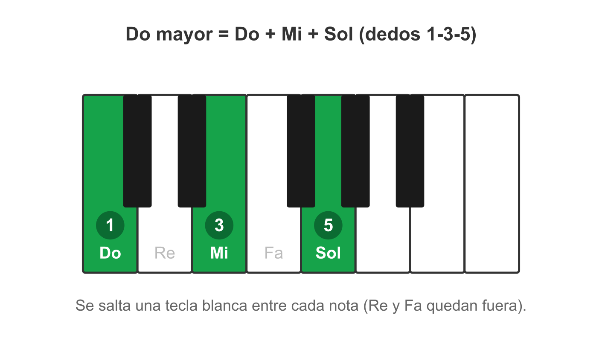
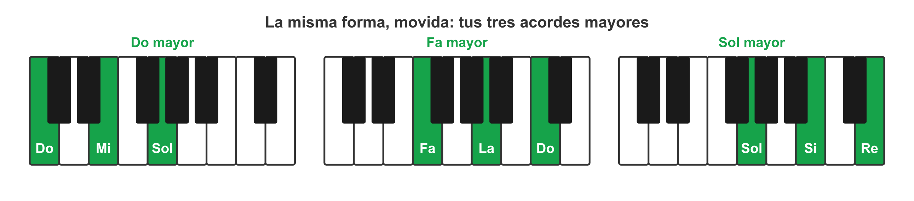
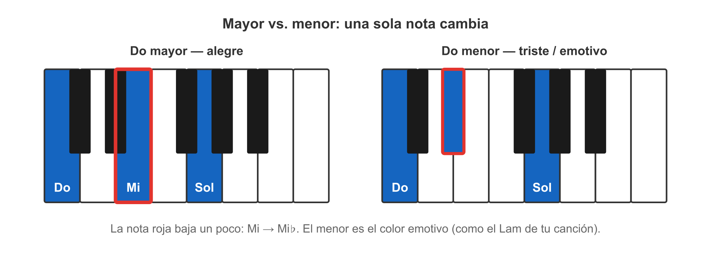

# 🎵 El acorde: varias notas que suenan bien juntas

> **Un acorde es tocar tres o más notas al mismo tiempo, elegidas para que suenen bien juntas. Es la unidad básica con la que se acompañan las canciones.**
> Cuando escuchas el piano de una canción worship "rellenando" debajo de la voz, eso son acordes.

Una sola nota suena fina, sola. Junta tres notas bien elegidas y de pronto hay **cuerpo, emoción, color**. Eso es un acorde. El cifrado (nota 2) es justo la lista de qué acordes tocar y cuándo.

## 🎵 El acorde mayor

> **El acorde mayor es el que suena estable, completo y "alegre". El primero que vas a formar es Do mayor: las notas Do + Mi + Sol tocadas a la vez.**

Para formar **Do mayor** con la mano derecha:
- **Do** con el dedo 1 (pulgar)
- **Mi** con el dedo 3 (medio)
- **Sol** con el dedo 5 (meñique)

Las tres juntas. ¿Por qué suena tan "en su sitio"? Porque Do-Mi-Sol son notas que encajan de forma muy estable (se saltan una blanca entre cada una: Do, _salto Re_, Mi, _salto Fa_, Sol). No necesitas la teoría profunda ahora — solo reconocer ese sonido **firme y luminoso** como "mayor".

*Do mayor es una forma fija: Do-Mi-Sol con los dedos 1-3-5, saltando una blanca entre cada una.*

Tus tres primeros acordes mayores, los de las semanas 1-2, se forman con la misma idea (una sí, una no):
- **Do mayor** = Do · Mi · Sol
- **Sol mayor** = Sol · Si · Re
- **Fa mayor** = Fa · La · Do

*La misma forma "una sí, una no", movida: Do, Fa y Sol mayores.*

## 🎵 Mayor vs. menor — alegre vs. triste

> **La diferencia entre un acorde mayor y uno menor es una sola nota que se mueve un pelito, y eso cambia todo el color: el mayor suena alegre, el menor suena triste o melancólico.**

Si el acorde mayor es "luz", el menor es "sombra cálida". No es peor — es la herramienta de la **emoción**. Las canciones que te tocan el corazón usan los dos: el mayor da firmeza, el menor da el nudo en la garganta.

*Una sola nota baja (Mi → Mi♭) y el acorde pasa de alegre a emotivo.*

Esto es justo lo que vas a entrenar en **Oído Perfecto** estas semanas: te suena un acorde y reconoces *¿alegre (mayor) o triste (menor)?* Es el músculo que Yousician nunca te dio: oír y entender, no solo apretar.

**En 10,000 Reasons** aparece **Lam (La menor)** entre los acordes mayores. Ese acorde menor es el que le pone el toque emotivo, el que hace que la canción "sienta". Cuando lo toques, vas a oír esa sombra cálida — y vas a entender *por qué* está ahí.

> 📋 **Repaso en una pantalla**
> - **Acorde** = 3+ notas a la vez que suenan bien juntas. La base del acompañamiento.
> - **Acorde mayor** = suena estable y alegre. **Do mayor = Do+Mi+Sol** (dedos 1-3-5).
> - Tus 3 primeros: **Do** (Do-Mi-Sol) · **Sol** (Sol-Si-Re) · **Fa** (Fa-La-Do).
> - **Mayor vs. menor** = una nota de diferencia; mayor = alegre, menor = triste/emotivo.
> - **Lam (La menor)** es el acorde emotivo de 10,000 Reasons. Mayor vs. menor = tu ejercicio de Oído Perfecto.

> 🎹 **Ahora al teclado:** forma **Do mayor** (Do-Mi-Sol, dedos 1-3-5). Fórmalo, suéltalo, repite ~10 veces, escuchando. Luego prueba **Sol mayor** (Sol-Si-Re). Ve a hacerlo — el acorde no se aprende leyendo, se aprende en los dedos y el oído.

---
[[03_dedos-y-manos|← Los dedos]] · [[00_indice|índice]]
