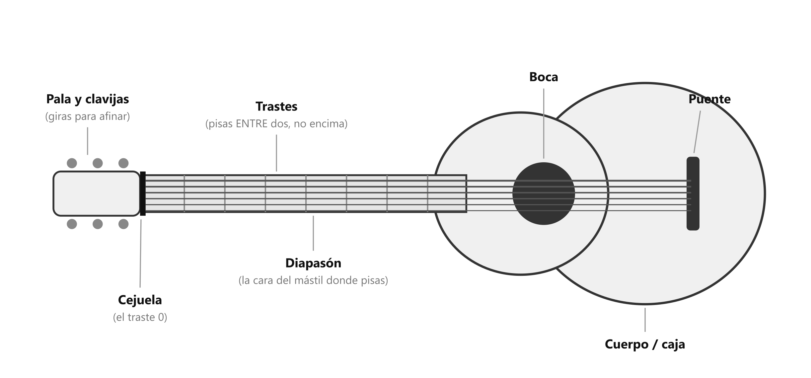

# 🎸 La guitarra: partes, cómo sostenerla, afinar, cuidado

> **Nota de consulta.** No es un paso del temario: es lo que antes era el "módulo 0" y que la academia va a cubrir en la primera clase. Se mira si hace falta. **Lo único obligatorio de aquí es afinar — cada vez, antes de tocar.**

## ⚠️ Afinar (esto sí, siempre)

Con la guitarra desafinada tu oído aprende mal sin que te des cuenta, y los acordes suenan "raros" aunque los formes bien. **Afinar es lo primero de cada sesión.** Toma un minuto.

- **Las 6 cuerdas, de la más gruesa a la más fina:** **Mi · La · Re · Sol · Si · Mi** (en cifrado americano: **E · A · D · G · B · E**).
- **Cómo:** con un **afinador** — app en el celular (cualquiera gratuita que escuche por el micrófono) o afinador de pinza que se engancha en la pala. Tocas una cuerda al aire, el afinador te dice si está alta o baja, giras la clavija hasta que marque en verde. Cuerda por cuerda.
- **Truco para no romper cuerdas:** siempre afina *subiendo* hacia la nota (si te pasaste, baja un poco y vuelve a subir).

## Partes (las que vas a nombrar)

*Las siete partes que los apuntes y el profesor nombran.*

| Parte | Qué es |
|---|---|
| **Cuerpo / caja** | La parte grande y hueca. Donde suena. |
| **Boca** | El agujero redondo. Sobre él (un poco hacia el mástil) va la mano derecha. |
| **Puente** | La pieza en el cuerpo donde se atan las cuerdas por abajo. |
| **Mástil** | El brazo largo. Por delante tiene el **diapasón**. |
| **Diapasón** | La cara del mástil donde pisas las cuerdas. |
| **Trastes** | Las barritas de metal que cruzan el diapasón. "Traste 1" es el más cercano a la pala. Pisas *entre* dos trastes, no encima. |
| **Cejuela** | La pieza blanca donde terminan los trastes, arriba. Las cuerdas pasan por ahí. |
| **Pala / clavijero** | La punta con las **clavijas** (los tornillos que giras para afinar). |

## Cómo sostenerla (sentado)

Dos posiciones válidas; el profesor va a corregir la tuya, así que no hay que perfeccionarla ahora:

- **Casual:** guitarra sobre la pierna derecha, mástil algo inclinado hacia arriba. Es la de quien acompaña cantando.
- **Clásica:** guitarra sobre la pierna izquierda (elevada con un reposapiés o un cojín), mástil bastante inclinado. Es la que la academia probablemente enseñe con guitarra de nylon.

En las dos: **espalda recta sin rigidez**, hombros sueltos, la guitarra pegada al cuerpo sin abrazarla, el mástil no apunta al suelo. La mano izquierda **no sostiene** la guitarra — está libre para los acordes.

## Cuidado (lo mínimo)

- **Cuerdas de nylon:** las que tiene. No cambiarlas ahora. Se cambian cuando se ven opacas o suenan sordas — meses.
- **No dejarla al sol ni cerca del calor.** El nylon y la madera se resienten.
- **Guardarla en su funda o apoyada segura.** Una caída rompe la pala.

> 📋 **Repaso en una pantalla**
> - **Afinar antes de tocar, siempre.** Mi-La-Re-Sol-Si-Mi, con afinador, subiendo hacia la nota.
> - Pisas **entre** trastes. Traste 1 = junto a la pala.
> - Mano derecha sobre la boca; mano izquierda no sostiene la guitarra.
> - Postura: la corrige el profesor. Aquí solo espalda recta y hombros sueltos.
