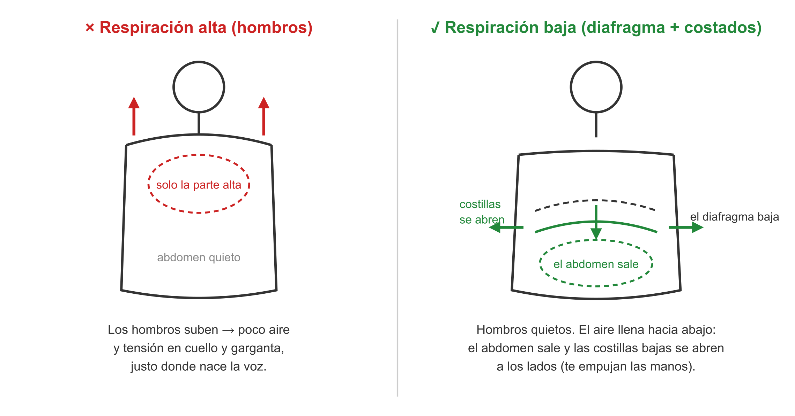
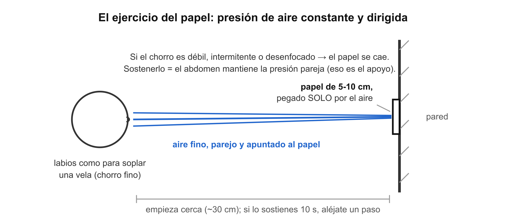

# 🎤 Respirar para cantar: diafragma, costados y presión de aire

> **Se lee lejos del ensayo.** La técnica de la clase 1 de canto, explicada. Su práctica: [[clase01_practica_respiracion-trino]].

## Por qué la respiración va primero

La voz es aire convertido en sonido: el aire pasa entre las cuerdas vocales y las hace vibrar. Hablar gasta poco aire en frases cortas. Cantar exige frases largas y notas sostenidas, así que necesitas dos cosas que hablar no pide: **entrar más aire** y —lo más importante— **soltarlo más lento y parejo**. Lo que se entrena no es inhalar mucho: es **controlar la salida**. Todos los ejercicios de la clase 1 entrenan eso.

## El diafragma: qué es y qué hace

El **diafragma** es un músculo ancho en forma de cúpula, debajo de los pulmones. Al inhalar se contrae y **baja**, y los pulmones se llenan hacia abajo. Como el diafragma baja, empuja lo que tiene debajo: por eso **el abdomen sale** al inhalar bien. No es que "respiras con el estómago" — el aire siempre va a los pulmones; el abdomen se mueve porque el diafragma bajó.

## La respiración que enseñó el profesor: abdomen + costados

Tiene nombre técnico: **respiración costo-diafragmática** ("costo" por las costillas). Suma dos expansiones:

1. **Abajo:** el diafragma baja → el abdomen sale.
2. **A los lados:** las costillas bajas (las flotantes) se **abren hacia afuera** → entra todavía más aire sin subir nada.

**Test con las manos:** una mano en el abdomen y otra en un costado bajo, sobre las últimas costillas. Al inhalar, **las dos manos deben ser empujadas hacia afuera**. Los hombros no se mueven.

*Izquierda: lo que se corrige. Derecha: lo que se entrena.*

**Por qué la respiración alta (hombros) está mal:** llena solo la parte alta de los pulmones (poco aire) y tensa cuello y hombros — exactamente la zona por donde sale la voz. Cantar tenso desde el aire es empezar perdiendo.

## El ejercicio del papel: la presión hecha visible

Un papel de 5-10 cm contra la pared, sostenido solo por tu soplido. Lo que entrena tiene nombre: **apoyo** — mantener la presión de aire **constante** con los músculos del abdomen, no con la garganta.

El papel es un medidor honesto: se cae si el chorro es débil, si es intermitente (sueltas el aire a golpes) o si está desenfocado (soplas ancho). Sostenerlo exige exactamente lo que una nota larga exige: presión pareja, dirigida, sin picos ni caídas.

*El mismo abdomen que empuja el papel es el que sostiene una nota de 8 segundos.*

## El siseo: la frase sin la voz

Soltar el aire en una **"sssss" larga y pareja**. Los dientes casi cerrados dejan una rendija mínima, así que el aire dura mucho y cualquier irregularidad **se oye**: si la "s" tiembla, tu aire tiembla; si arranca fuerte y muere, soltaste todo al inicio. Cantar una frase larga es exactamente esto — aire parejo durante segundos — con la voz montada encima.

Dos virtudes que lo hacen ejercicio de todos los días:

- **Se cronometra.** Es el único de los tres que da un número (segundos), y por eso mide tu avance: la evaluación de M1 pide ≥ 20 s parejos.
- **No gasta la voz.** Las cuerdas vocales no vibran, así que puedes repetirlo sin cansarte ni lastimarte.

**Papel vs. siseo, que no son lo mismo:** el papel entrena la presión *dirigida* a un punto (puntería del aire); el siseo entrena su *duración* en el tiempo (tanque del aire). Juntos son el apoyo completo.

## El trino de labios (lip trill)

Labios sueltos vibrando con el aire — el "brrr" de caballo — mientras la voz suena por debajo. Subir y bajar la altura durante el trino es hacer una **sirena**.

Por qué es el ejercicio favorito de todos los profesores:

- **Solo funciona con aire parejo.** Si el aire llega a golpes o se acaba, los labios dejan de vibrar al instante. Es otro medidor honesto, como el papel.
- **Protege la voz.** Los labios semicerrados frenan un poco la salida del aire, y ese freno deja a las cuerdas vocales vibrar con mínimo esfuerzo. Por eso se puede subir más agudo en trino que cantando abierto, sin dañarse.
- **Conecta aire y voz.** Es las dos cosas a la vez — soltar aire parejo y hacer sonar la voz encima: el puente entre este módulo y el siguiente.

> 📋 **Repaso en una pantalla**
> - Cantar = controlar la **salida** del aire, no inhalar mucho.
> - Inhalar bien: el **abdomen sale** (diafragma baja) y las **costillas bajas se abren** (las manos en los costados lo comprueban). Hombros quietos.
> - **Apoyo** = presión de aire constante desde el abdomen. El papel en la pared lo mide.
> - **Siseo** = la frase sin la voz: duración del aire, cronometrable (meta M1: ≥ 20 s parejos), no gasta la voz.
> - **Trino de labios**: solo vibra con aire parejo; protege las cuerdas; con subidas y bajadas es una sirena.

---
[[00_indice|índice]] · su práctica: [[clase01_practica_respiracion-trino]]
