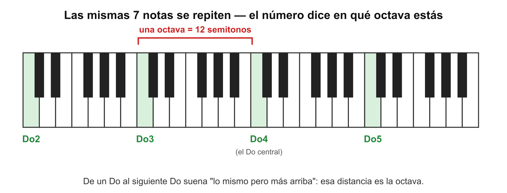
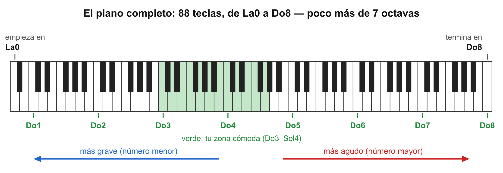
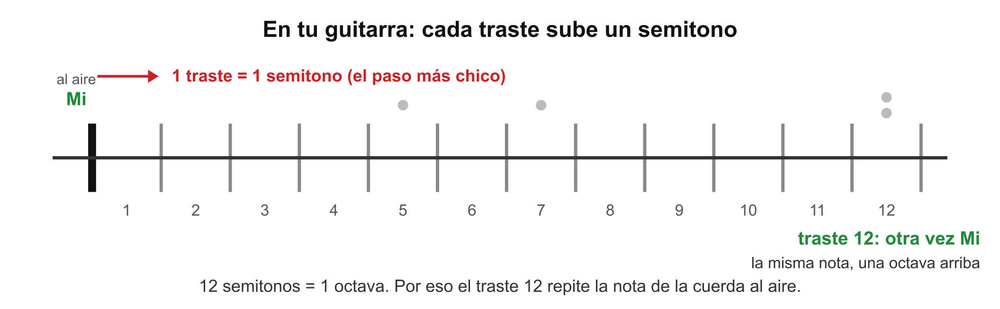
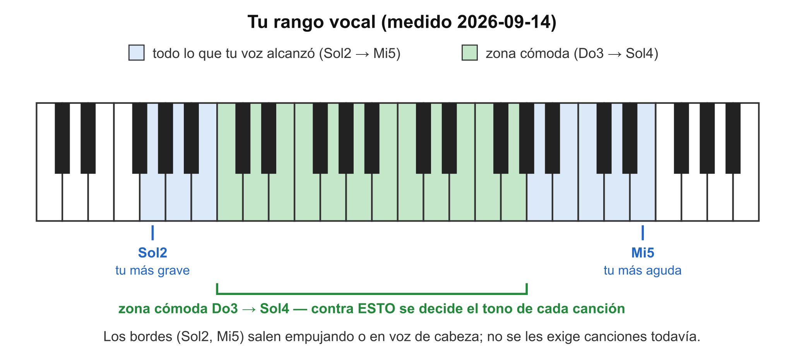

# 🎼 El mapa de las notas: octavas, semitonos y tu rango

> **Se lee lejos del instrumento.** Las notas, las octavas y los semitonos, en el orden en que un concepto abre el siguiente, hasta llegar a tu rango vocal y al tono de una canción.

## 1. Las 7 notas se repiten

Ya sabes las 7 notas y su cifrado: Do Re Mi Fa Sol La Si = C D E F G A B ([[../../guitarra/m1/clase01_notas-y-cuerdas|el apunte de la clase 1 de guitarra]]). Lo que falta decir: después de Si **no hay una octava nota nueva** — vuelve a venir Do, y otra vez Re, y así. La música entera usa esas 7 notas (más sus alteraciones, los sostenidos `#`), repetidas una y otra vez de lo grave a lo agudo.

**Pruébalo en tu guitarra:** la cuerda 6 al aire es Mi, y la cuerda 1 al aire también es Mi. Son la misma nota — una gruesa y grave, la otra fina y aguda. Tu oído las reconoce como "la misma, pero más arriba".

## 2. La octava: la distancia entre una nota y su repetición

Esa distancia — de un Do al siguiente Do, de un Mi al siguiente Mi — se llama **octava** ("octava" porque contando Do-Re-Mi-Fa-Sol-La-Si-Do, la repetición es la octava nota).

*Cada Do verde es "la misma nota" en una vuelta distinta.*

## 3. El número dice en qué octava estás

"Do3", "Sol4", "Mi5": la nota dice **cuál** de las 7 es, y el número dice **en qué octava** — a mayor número, más agudo. Así dos personas pueden hablar de notas sin ambigüedad: no "un Sol agudo", sino **Sol4**. El Do central del piano es Do4, y es la referencia universal.

Tres precisiones que evitan confusiones:

- **El número cambia justo en cada Do**, no en La ni en otra nota. Después de Si3 viene **Do4**: Do3-Re3-Mi3-Fa3-Sol3-La3-Si3 → Do4.
- **La numeración empieza en 0**, y el piano completo no arranca en un Do: su tecla más grave es **La0** y la más aguda **Do8** — 88 teclas, poco más de 7 octavas.
- **Fuera del piano quedan sonidos, pero no notas útiles.** Más abajo de La0 el oído siente vibración sin distinguir la nota; más arriba de Do8 es un silbido. Todo lo que vas a tocar y cantar vive dentro: tu guitarra va de Mi2 a cerca de Si5, y tu voz de Sol2 a Mi5 — casi el mismo territorio, por eso la guitarra es buena referencia para tu voz.

*El teclado de los diagramas anteriores es solo la rebanada central de este.*

## 4. El semitono: el paso más chico

Entre las notas hay pasos. El paso más chico que usa nuestra música se llama **semitono**, y tu guitarra lo tiene construido: **cada traste sube exactamente un semitono**. Doce semitonos completan una octava — por eso el traste 12 repite la nota de la cuerda al aire.

*El capo también funciona así: capo en traste 4 = todo sube 4 semitonos.*

## 5. El rango vocal: el territorio de tu voz

Tu voz también vive en este mapa. Llega hasta una nota grave y hasta una aguda; ese territorio es tu **rango vocal**. Y dentro del rango hay dos zonas distintas:

- **Los extremos:** las notas que salen empujando, o en la voz liviana de arriba. El sonido sale, pero no se deja moldear — en tus palabras: 'parece un sonido que puedo hacer', no una nota que puedas cantar con cuerpo. Existen, pero no se les pide canciones.
- **La zona cómoda** (nombre técnico: **tesitura**): donde tu voz suena con cuerpo y sin esfuerzo. **Es el único número con el que se trabaja.**

*Tu medición del 2026-09-14. Se remide cada tanto; el perfil guarda la vigente.*

## 6. El tono de una canción — y por qué se puede mover

Una canción usa un puñado de notas que viven en cierta altura del mapa: eso es su **tono**. Si el coro de una canción sube hasta Si4 y tu techo cómodo es Sol4, no es que "no puedas cantarla": está en el tono de otro cantante. **Transportar** es mover la canción entera, todos sus acordes y toda su melodía, la misma cantidad de semitonos hacia abajo (o arriba) hasta que quepa en tu zona. En la guitarra, el capo transporta hacia arriba sin cambiar las formas; para bajar, se cambian las formas de los acordes (eso se aprende en M5). La canción sigue siendo la misma; solo suena más grave o más aguda. *(El detalle completo, en M4.)*

## 7. Los tipos de voz

Las voces se agrupan según dónde cae su zona cómoda. De grave a aguda: en hombres **bajo → barítono → tenor**; en mujeres **contralto → mezzosoprano → soprano**. No es un nivel ni un mérito — es como la talla de zapato: describe, no califica. Sirve para saber qué tonos te van a quedar bien de fábrica. Tu zona cómoda (Do3–Sol4) cae en territorio de **tenor**: voz masculina aguda.

> 📋 **Repaso en una pantalla**
> - 7 notas que **se repiten**; la repetición está a una **octava**; el número (Do3, Sol4) dice la octava.
> - **Semitono** = el paso más chico = **1 traste** de tu guitarra; 12 semitonos = 1 octava.
> - **Rango** = de tu nota más grave a la más aguda; **zona cómoda (tesitura)** = donde la voz suena sin esfuerzo — el único número de trabajo.
> - **Tono** = la altura en la que está una canción; **transportar** = moverla entera (en semitonos) hasta tu zona. El capo transporta.
> - Voces de grave a aguda: bajo, barítono, **tenor** (la tuya) · contralto, mezzosoprano, soprano.

---
[[../../00_indice|índice]] · [[../../guitarra/m1/clase01_notas-y-cuerdas|← Las notas y las cuerdas]]
