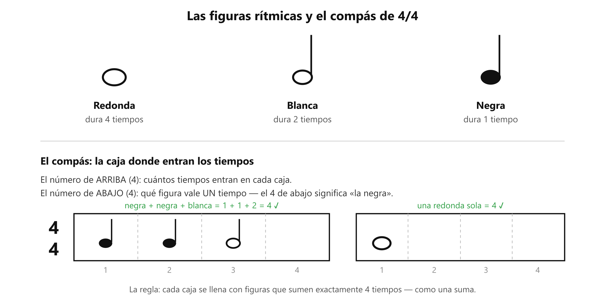

# 🎸 Práctica — Figuras con metrónomo

> **Con la guitarra afinada y el metrónomo en 60.** Es la segunda tarea de la clase 1.

## 🎯 Qué estás mejorando (en claro)

**Llevar el pulso por dentro, sin depender de la app.** Es la habilidad de tocar cada nota *en el momento* correcto, no solo la nota correcta. Es lo contrario de Yousician: allá la pista marcaba el ritmo por ti y por eso no quedaba nada; aquí el pulso lo llevas tú.

**Lo vas a notar** el día que apagues el metrónomo, sigas tocando, lo vuelvas a encender… y sigas cuadrado con él. Ese día el reloj ya es tuyo.

## El gráfico

*Esto es lo que vas a tocar: cajas de 4 tiempos llenadas con negras, blancas y redondas.*

## Cómo se hace cada paso (referencia)

Siempre: metrónomo en **60**, una sola cuerda al aire (la 6ª, bien grave — el ejercicio es de tiempo, no de dedos), y **contando en voz alta: 1-2-3-4**.

- **Negras:** una nota por clic — cada número con su nota.
- **Blancas:** tocas en el **1** y en el **3**; en el 2 y el 4 la nota **sigue sonando** (la sostienes, no la cortas).
- **Redondas:** tocas solo en el **1** y dejas sonar los 4 tiempos.

## ⏱️ Los 3 niveles del día — elige según cómo amaneciste

**Pon cronómetro. Cuando suena, paras.** Cada nivel incluye al anterior. Aquí el metrónomo va **siempre** — en esta práctica, el metrónomo ES el ejercicio.

### 🔵 Mínimo — 5 min (día sin ganas; hecho esto, CUMPLISTE)
| Qué | Cuánto |
|---|---|
| Negras | ~2 min de cajas seguidas |
| Blancas | ~1.5 min |
| Redondas | ~1.5 min |

### 🟢 Natural — 10 min (el día normal)
Todo el Mínimo, y además:
| Qué | Cuánto |
|---|---|
| **La mezcla, sin parar entre cajas:** 2 cajas de negras → 2 de blancas → 1 redonda, en bucle | ~3 min |
| La araña V1 con metrónomo, una nota por clic (aquí se juntan tus dos tareas) | ~2 min |

### 🔥 Motivado — 15 min
Todo el Natural, y además:
| Qué | Cuánto |
|---|---|
| **El test del reloj:** en plenas negras, APAGA el metrónomo, sigue tocando y contando 2 cajas, préndelo de nuevo — ¿sigues cuadrado con el clic? | ~3 min |
| Sube a **70** y repite las negras | ~2 min |

El test del reloj es la meta de toda esta práctica: el día que lo pases seguido, el reloj ya es tuyo.

## Cómo suena cuando está bien

Tu nota **se come al clic**: suenan tan juntos que parecen un solo sonido. Si escuchas "clic-nota" como dos cosas separadas, vas tarde (o temprano).

## Si sale mal — los 3 típicos

| Pasa esto | Casi siempre es | Arréglalo así |
|---|---|---|
| **Te adelantas al clic** | Ansiedad de "ya sé lo que viene" | No anticipes: **espera** oírlo. Contar en voz alta y fuerte te ancla |
| **Te pierdes en la cuenta** | Vas más rápido de lo que tu cabeza procesa | Baja a 50. No es retroceder: es ponerte donde sí puedes ganar |
| **Te tensas** (hombros, mandíbula) | Concentración convertida en rigidez | Suelta hombros entre caja y caja. El pulso vive en el cuerpo relajado |

## Afinación del instructor

Una sola: haz el paso 1 **también sin guitarra** en cualquier momento del día — palmas con el metrónomo del celular, 60 bpm, contando en voz alta. Dos minutos en el bus valen. El reloj interno se entrena a todas horas, no solo con el instrumento.

## Hasta cuándo / cuándo ya está

Fue la tarea de la clase 1. No se "aprueba", se incorpora: contar en voz alta acompaña toda práctica con ritmo hasta que el conteo salga solo, por dentro. **Está lista** cuando pasas el test del reloj (nivel 🔥) tres días seguidos.

## Qué sigue

El rasgueo de M3 en el temario: de 3.3 (rasgueo hacia abajo) a 3.6 (rasguear sin parar mientras cambias de acorde), sobre este mismo pulso.
