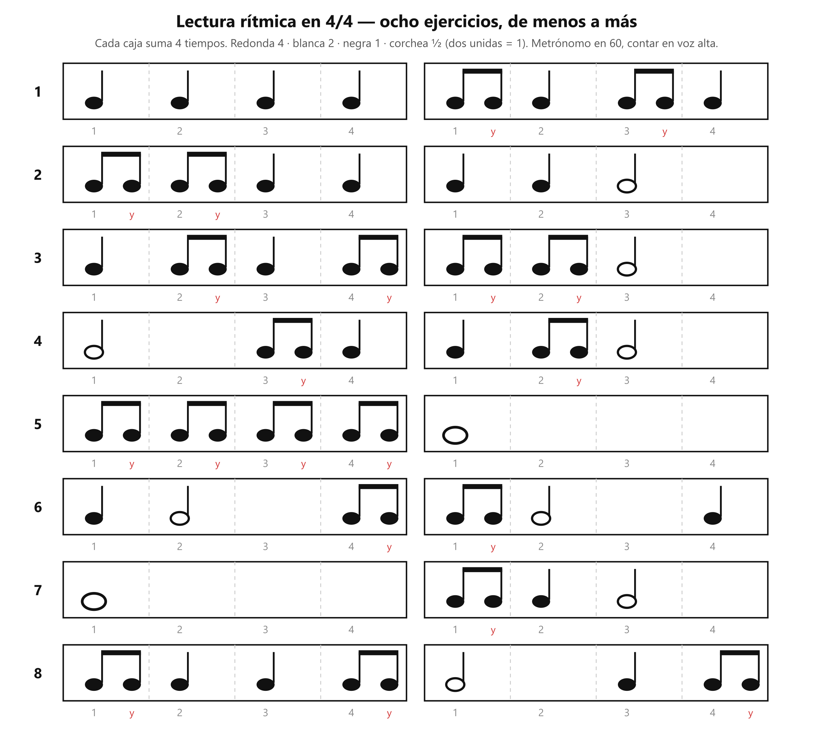

# 🎸 Práctica — Lectura rítmica con corcheas

> **Con la guitarra afinada y el metrónomo en 60.** Es la tarea de la clase 3: el profesor dibuja compases con figuras y tú los tocas a tiempo — aquí tienes ocho, del mismo tipo, ordenados de menos a más.

## 🎯 Qué estás mejorando (en claro)

**Leer un ritmo escrito y tocarlo a tiempo, con el pulso partido en dos.** Es el paso que sigue a [Figuras con metrónomo](../m3/clase01_practica_ritmo-metronomo.md): allá cada figura duraba tiempos enteros; aquí entra la corchea y tu mano tiene que caer también *entre* los clics. **Lo vas a notar** cuando un compás nuevo del profesor te salga a la primera, sin descifrarlo nota por nota — y cuando el rasgueo abajo-arriba llegue, la «y» ya va a vivir en tu mano.

## El gráfico

*Esto es lo que se toca: cada caja suma 4. La «y» roja marca dónde la nota cae entre clics.*

## Cómo se hace (referencia)

Siempre: metrónomo en **60**, una sola cuerda al aire (la 6ª — el ejercicio es de tiempo, no de dedos), y **contando en voz alta: «1 y 2 y 3 y 4 y»**.

- **Redonda / blanca / negra:** igual que siempre — tocas en su número y la dejas sonar lo que dura.
- **Par de corcheas:** primera nota **con el clic**, segunda en la **«y»**, justo a la mitad. Parejas, como gemelas.
- **Antes de tocar un ejercicio, léelo:** dilo en voz alta con la cuenta («1 y-2, 3, 4…») sin guitarra.

## ⏱️ Los 3 niveles del día — elige según cómo amaneciste

**Pon cronómetro. Cuando suena, paras.** Cada nivel incluye al anterior. El metrónomo va **siempre**.

### 🔵 Mínimo — 5 min (día sin ganas; hecho esto, CUMPLISTE)

| Qué                                                                 | Cuánto |
| -------------------------------------------------------------------- | ------- |
| Ejercicios 1 y 2, cada uno en bucle hasta que salga 2 veces seguidas | 2 min   |
| Ejercicios 3 y 4, igual                                              | 3 min   |

Metrónomo: sí, en 60.

### 🟢 Natural — 10 min (el día normal)

Todo el Mínimo, y además:

| Qué                                   | Cuánto |
| -------------------------------------- | ------- |
| Ejercicios 5 y 6                       | 3 min   |
| El que peor salió hoy, solo, en bucle | 2 min   |

### 🔥 Motivado — 15 min

Todo el Natural, y además:

| Qué                                                                                                                                   | Cuánto |
| -------------------------------------------------------------------------------------------------------------------------------------- | ------- |
| Ejercicios 7 y 8                                                                                                                       | 3 min   |
| **Test del reloj con corcheas:** en pleno ejercicio 5, apaga el metrónomo, sigue 2 compases contando, préndelo — ¿sigues cuadrado? | 2 min   |

## Cómo suena cuando está bien

Las dos corcheas de cada par suenan **idénticas**: mismo volumen, misma distancia. La primera se come al clic; la «y» cae sola en el medio exacto. Si el par suena "cojo" (larga-corta, como un galope), la «y» está llegando tarde.

## Si sale mal — los 3 típicos

| Pasa esto                               | Casi siempre es                                             | Arréglalo así                                                                                              |
| --------------------------------------- | ----------------------------------------------------------- | ------------------------------------------------------------------------------------------------------------ |
| **El par suena a galope** (larga-corta) | La «y» cae tarde, pegada al clic siguiente                | Di la cuenta en voz alta SIN tocar hasta que las sílabas salgan parejas; luego toca encima de tu propia voz |
| **Te aceleras en las corcheas**         | Más notas se sienten como "más rápido" y el cuerpo se va | El clic manda: vuelve a un compás de solo negras, ancla el pulso, y reintenta                               |
| **Te pierdes al cambiar de figura**     | Lees la nota cuando ya hay que tocarla                      | Lee el compás completo en voz alta antes de tocarlo; ojos una caja adelante, como al leer                   |

## Afinación del instructor

1. **Sin guitarra vale:** palmas con el metrónomo del celular, contando «1 y 2 y…». Dos minutos en el bus entrenan lo mismo.
2. **Escribe los tuyos:** dibuja en papel 2-3 compases que sumen 4 (con la moneda nueva de ½) y tócalos. Escribir un ritmo es la prueba de que lo entiendes — y te fabrica ejercicios infinitos, como los del profesor.

## Hasta cuándo / cuándo ya está

Es tarea de la academia: hasta la próxima clase (martes 22-sep). **Está lista** cuando los ejercicios 7 y 8 salen a la primera, con clic en 60 y la cuenta en voz alta.

## Qué sigue

En el mapa: el rasgueo de M3 (3.3 → 3.6) — estas mismas corcheas, hechas mano derecha (abajo en el número, arriba en la «y»). Más adelante, M6: acentos, silencios y más patrones de rasgueo.
