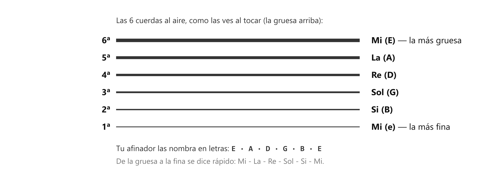

# 🎵 Las notas, y cada cuerda es una nota

> **Solo hay 7 notas: Do, Re, Mi, Fa, Sol, La, Si — y luego se repiten.** Toda la música que vas a tocar está hecha de esas siete. Y cada cuerda de tu guitarra, tocada sin pisar nada, ya suena a una de ellas.

## Los dos nombres de cada nota

Las notas tienen dos escrituras: la nuestra (Do, Re, Mi...) y la **americana**, con letras. Son **la misma cosa** — y necesitas las dos, porque todo lo que encuentres en internet (cifrados, tablaturas, tu afinador) habla en letras:

| Do | Re | Mi | Fa | Sol | La | Si |
|:-:|:-:|:-:|:-:|:-:|:-:|:-:|
| **C** | **D** | **E** | **F** | **G** | **A** | **B** |

Truco para no perderse: las letras **no empiezan en Do sino en La** (La = A, Si = B, Do = C...). Si memorizas **Do = C**, el resto sale contando.

## Cada cuerda al aire es una nota

"Al aire" = tocarla sin pisar ningún traste. De la más gruesa a la más fina:

| Cuerda | Nota | Letra |
|:-:|:-:|:-:|
| **6ª** (la más gruesa, arriba cuando la sostienes) | **Mi** | E |
| **5ª** | **La** | A |
| **4ª** | **Re** | D |
| **3ª** | **Sol** | G |
| **2ª** | **Si** | B |
| **1ª** (la más fina, abajo) | **Mi** | e |

Fíjate: la primera y la última son **las dos Mi** — una grave y una aguda. Por eso el orden se dice rápido: **Mi-La-Re-Sol-Si-Mi**.

*El grosor del dibujo es el grosor real: la 6ª es la gorda de arriba.*

**Dónde ya usas esto sin saberlo:** tu afinador. Cuando afinas, la app te muestra **E, A, D, G, B, E** — ahora ya sabes que te está diciendo Mi, La, Re, Sol, Si, Mi.

> 📋 **Repaso en una pantalla**
> - 7 notas: **Do Re Mi Fa Sol La Si** = **C D E F G A B**. Las letras empiezan en La (A). Ancla: **Do = C**.
> - Cuerdas al aire, de gruesa a fina: **Mi La Re Sol Si Mi** (E A D G B e).
> - 6ª = la gruesa de arriba · 1ª = la fina de abajo. Las dos puntas son Mi.
> - El afinador habla en letras: E A D G B E.

---
[[00_indice|índice]] · [[clase01_tablatura|siguiente → La tablatura]]
