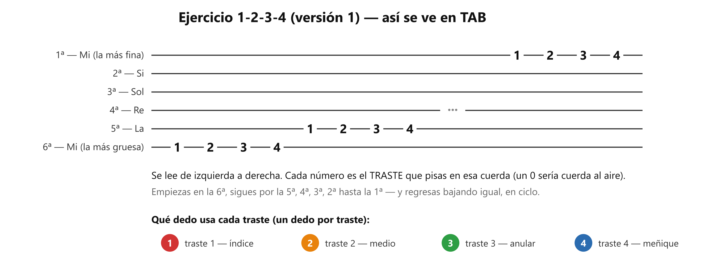

# 🎸 Práctica — El 1-2-3-4 (la "araña")

> **Con la guitarra en la mano, afinada.** Es la tarea del profesor de la clase 1. Este ejercicio es universal — se enseña en casi toda escuela del mundo, y por una razón.

## 🎯 Qué estás mejorando (en claro)

Dos cosas, y las vas a poder ver:

1. **Que cada dedo se mueva solo.** Hoy tu anular y tu meñique se mueven en manada — levantas uno y el otro se va detrás. Este ejercicio los separa. **Lo notarás** en unas semanas, cuando armes acordes y los dedos caigan cada uno en su sitio sin recolocarlos uno por uno.
2. **Que cada nota salga limpia**, no ahogada ni zumbando. **Lo notarás** dentro del mismo ejercicio: cada día habrá menos notas "sucias" por vuelta.

No es un ejercicio de velocidad. Tu propia intuición en clase fue correcta: *sonido limpio, no rápido*. Rápido llega solo, después.

## El gráfico

*Cada número es el traste. Un dedo por traste: 1-índice, 2-medio, 3-anular, 4-meñique.*

## Las 4 versiones (referencia — qué es cada una)

1. **V1 — subiendo:** en la 6ª cuerda pisa y toca traste 1, 2, 3, 4 (un dedo por traste, una nota a la vez). Pasa a la 5ª, igual. Sigue hasta la 1ª — y regresa bajando hasta la 6ª. **Eso es 1 ciclo.**
2. **V2 — al revés:** lo mismo pero **4-3-2-1** en cada cuerda.
3. **V3 — dedos que se quedan:** al pisar el 2, el 1 no se levanta; acumulas 1 → 1-2 → 1-2-3 → 1-2-3-4. Luego bajando con 4-3-2-1. *(La más valiosa y la más incómoda. Normal.)*
4. **V4 — moviéndose:** V1 corriendo la posición: trastes 1-2-3-4 → 2-3-4-5 → hasta 4-5-6-7, y de vuelta.

## ⏱️ Los 3 niveles del día — elige según cómo amaneciste

**Pon cronómetro. Cuando suena, paras** — sin culpa y sin "una más". Cada nivel incluye al anterior.

### 🔵 Mínimo — 5 min (día sin ganas; hecho esto, CUMPLISTE)

| Qué                                | Cuánto                        |
| ----------------------------------- | ------------------------------ |
| V1, lenta                           | 1 ciclo completo (~2 min)      |
| V2                                  | 1 ciclo (~2 min)               |
| Presión mínima (ver Afinación 1) | 3 notas en una cuerda (~1 min) |

Sin metrónomo. Nada más.

### 🟢 Natural — 12 min (el día normal)

Todo el Mínimo, y además:

| Qué                                                 | Cuánto           |
| ---------------------------------------------------- | ----------------- |
| **V3 (dedos que se quedan)**                         | 2 ciclos (~5 min) |
| V1 otra vez, vigilando**dedos cerca** (Afinación 2) | 1 ciclo (~2 min)  |

Sin metrónomo todavía.

### 🔥 Motivado — 20 min

Todo el Natural, y además:

| Qué                                     | Cuánto                         |
| ---------------------------------------- | ------------------------------- |
| V4 (moviendo posición)                  | 1 pasada, ida y vuelta (~4 min) |
| **Metrónomo 60: V1, una nota por clic** | ~4 min                          |

**La regla del metrónomo:** entra SOLO en la versión que ya te sale limpia sin él — por ahora, la V1. El día que la V1 con metrónomo salga cuadrada, el metrónomo pasa a la V2, y así una por una. Nunca metrónomo sobre una versión que aún suena sucia.

## Cómo suena cuando está bien

- Cada nota **limpia y entera** — sin zumbidos, sin sonar ahogada.
- **Parejas**: la del dedo 4 suena igual de fuerte que la del dedo 1 (el meñique tiende a sonar tímido).
- A un ritmo **constante**, aunque sea lento. Lento y parejo gana a rápido y a tropezones.

## Si sale mal — los 3 típicos

| Suena así               | Casi siempre es                                  | Arréglalo así                                                                                  |
| ------------------------ | ------------------------------------------------ | ------------------------------------------------------------------------------------------------ |
| **Zumba / vibra feo**    | Estás pisando lejos del traste o con poca punta | Pisa**justo detrás de la barrita** del traste (no encima, no lejos) y con la **punta** del dedo |
| **Se ahoga / no suena**  | Un dedo vecino está rozando esa cuerda          | Arquea más los dedos — cada uno cae de punta, como martillito, sin tocar a los vecinos         |
| **Se acelera y ensucia** | El cuerpo quiere "terminar rápido"              | El objetivo es limpio, no rápido: baja la velocidad hasta que TODAS suenen, y quédate ahí     |
