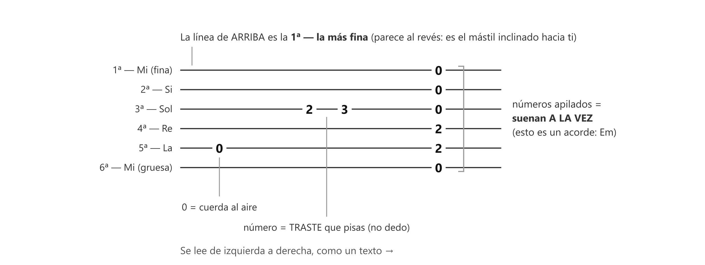

# 📄 La tablatura (TAB): el plano de qué pisar

> **La TAB es un dibujo de tus 6 cuerdas con números encima: cada número te dice qué traste pisar en esa cuerda.** No necesitas saber leer música para leerla — por eso es el idioma de los ejercicios y de media internet guitarrera.

*Todo lo que una TAB puede decir, en un solo ejemplo. La columna de la derecha es un acorde (Em).*

## Las reglas

1. **6 líneas = tus 6 cuerdas.** Y aquí el detalle que confunde a todos: **la línea de ARRIBA es la 1ª cuerda (la más fina)**, y la de abajo es la 6ª (la gruesa). Parece al revés — es como si miraras el mástil de tu guitarra inclinándolo hacia ti.
2. **Los números son TRASTES, no dedos.** Un `3` en una línea = pisa el traste 3 de esa cuerda. Qué dedo usar lo dice el ejercicio o el contexto. *(¿Qué es un traste? Las barritas de metal que cruzan el mástil; pisas entre dos, no encima → [[../_consulta-instrumento]].)*
3. **`0` = cuerda al aire.** Tócala sin pisar nada.
4. **Se lee de izquierda a derecha**, como un texto.
5. **Números en columna (uno sobre otro) = suenan a la vez.** Así se escriben los acordes en TAB. Números separados = uno tras otro.

Un ejemplo real ya lo tienes: el gráfico de tu práctica del 1-2-3-4 (`clase01_practica_independencia-1234`) está escrito en TAB.

> 📋 **Repaso en una pantalla**
> - 6 líneas = 6 cuerdas. **Arriba = 1ª (fina)**, abajo = 6ª (gruesa).
> - Número = **traste** (no dedo). `0` = al aire.
> - Izquierda → derecha. En columna = a la vez (acorde).

---
[[clase01_notas-y-cuerdas|← Las notas y cuerdas]] · [[00_indice|índice]] · [[clase01_dedos-mano-izquierda|siguiente → Los dedos]]
