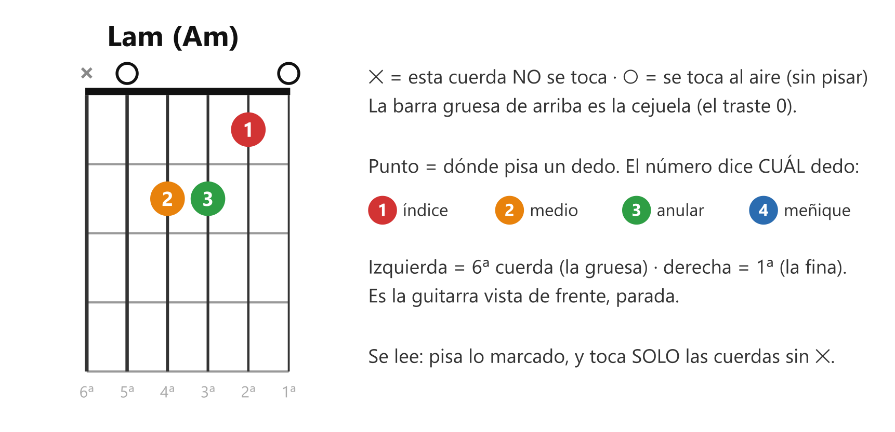
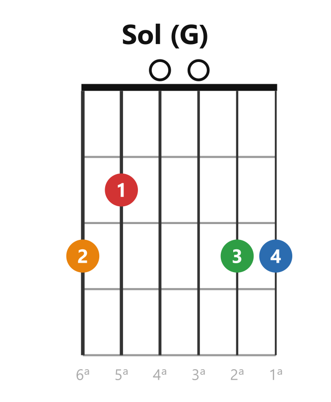
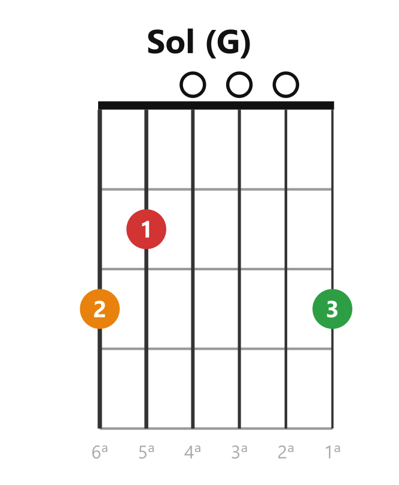
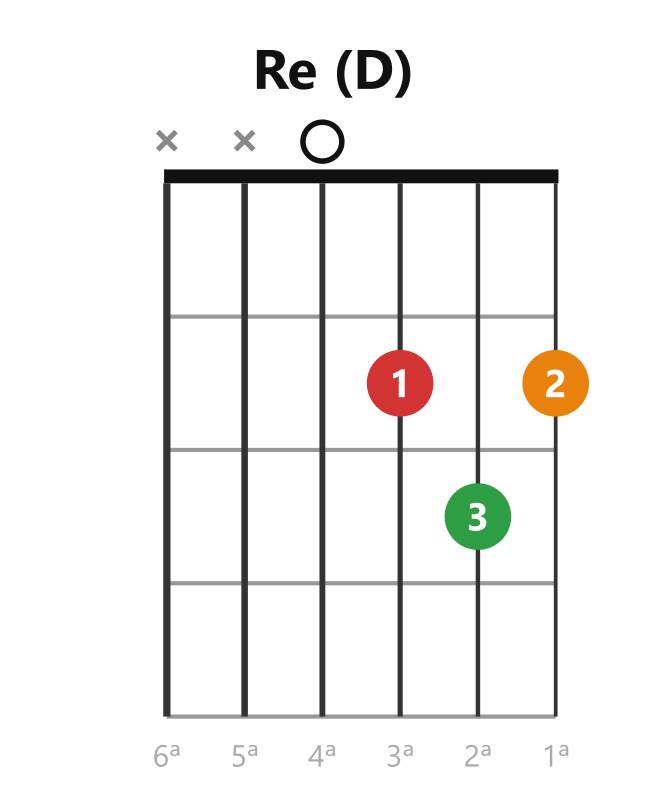
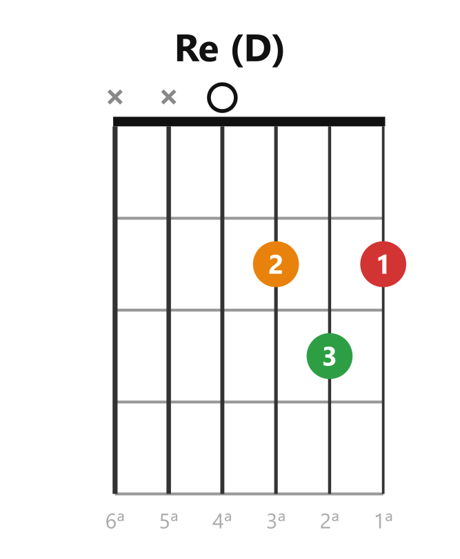
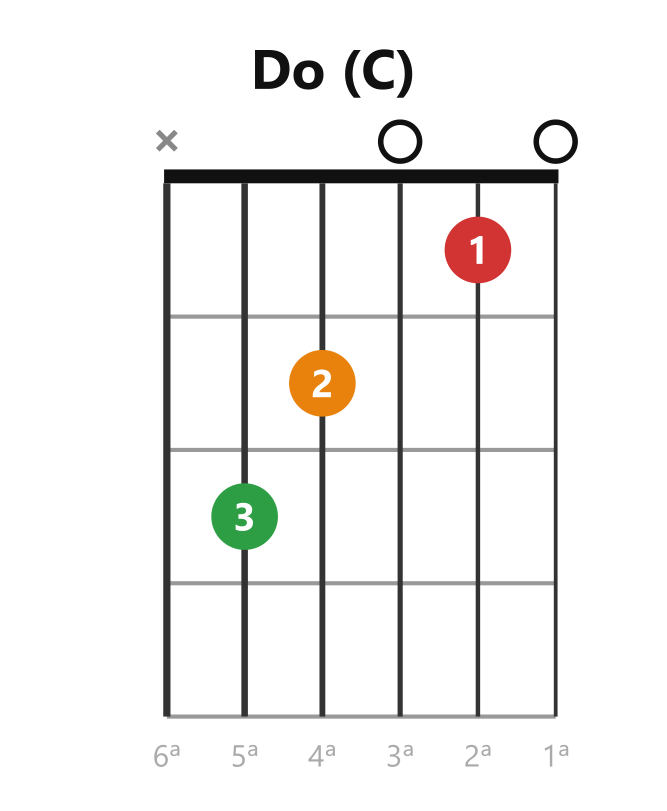
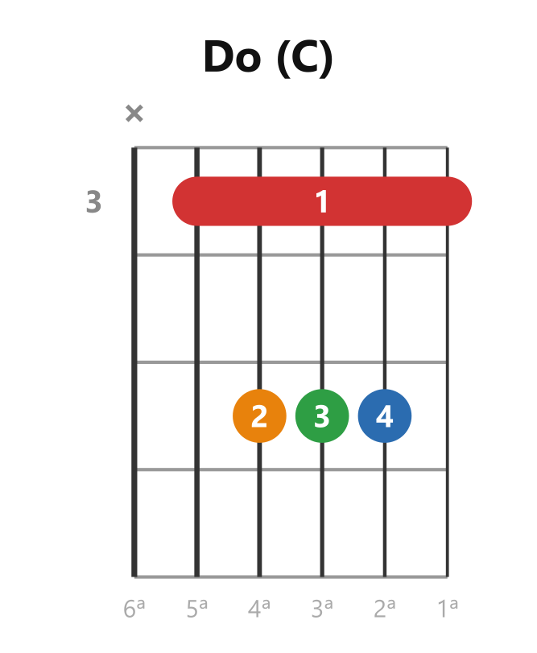
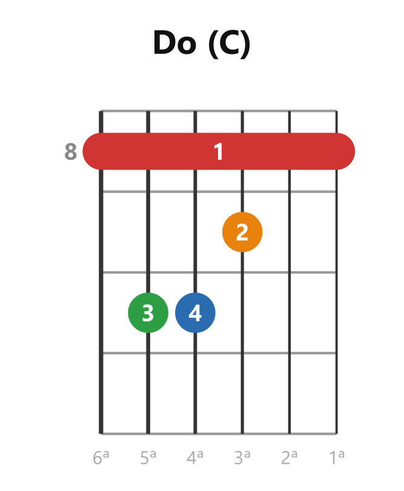

# 📐 El diagrama de acorde: la foto de la forma

> **El diagrama es una foto del mástil, de frente y parado, que dice dónde pisar y qué cuerdas tocar.** Es el idioma en que se comunican las formas de acorde — como la TAB es el de los ejercicios ([[clase01_tablatura]]).

*Todo lo que un diagrama puede decir, en un solo ejemplo.*

Las reglas, en orden de lectura:

1. **6 líneas verticales = tus 6 cuerdas.** Izquierda = 6ª (la gruesa), derecha = 1ª (la fina). *(Ojo: es lo contrario de la TAB, que es horizontal y pone la 1ª arriba.)*
2. **La barra gruesa de arriba = la cejuela** (el traste 0). Las líneas horizontales = los trastes.
3. **Punto = dónde pisa un dedo; el número dentro = cuál dedo** (1 índice · 2 medio · 3 anular · 4 meñique).
4. **✕ arriba de una cuerda = no se toca. ○ = se toca al aire.** El rasgueo abarca solo las cuerdas sin ✕.

## ¿Por qué un mismo acorde tiene varias digitaciones?

Porque **el acorde son las notas, no los dedos.** Mientras suenen esas notas, el acorde es ese — con 3 dedos, con 4, con la digitación que sea. Entonces, ¿por qué existe "la forma correcta"? Porque la digitación no se elige por el acorde solo:

> **Regla: la digitación correcta es la que hace más corto el siguiente cambio.** Se elige mirando qué acorde viene después, no el acorde solo: menos dedos que mover = cambio más rápido y más limpio.

Dos casos concretos de los 8 de la academia:

**G con 4 dedos** (la del curso) vs. **G con 3 dedos**: suenan casi igual y las dos son Sol. La de 4 deja los dedos 3-4 plantados donde los cambios hacia C y D los necesitan. La de 3 no está *mal* — está optimizada para otra cosa.

|  |  |
|:-:|:-:|
| *La del curso: 4 dedos* | *La versión de 3 dedos — también es Sol* |

**D con dos digitaciones**: aquí las casillas son **idénticas** — solo cambian los dedos. Digitación pura. La estándar (izquierda) comparte lógica con Dm y hace más corto el cambio D↔Dm.

|  |  |
|:-:|:-:|
| *La del curso: 1 en la 3ª, 2 en la 1ª* | *Mismas casillas, otros dedos* |

**¿Y si ya tocabas un acorde con otra digitación?** No estaba *incorrecta* si sonaba limpia — estaba *sin optimizar* para los cambios que vienen. La regla operativa: **la digitación del profesor manda**, por dos razones: él ve tu mano (el agente no), y su digitación está eligiendo por ti los cambios del curso completo. Reaprender una digitación cuesta unos días; arrastrar una ineficiente cuesta meses.

## No confundir: digitación vs. posición

Son dos preguntas distintas sobre el mismo acorde:

| | Responde | Qué cambia |
|---|---|---|
| **Digitación** | ¿Con qué dedos piso estas casillas? | Solo los dedos. Mismas casillas, mismo sonido. (El caso del D) |
| **Posición / forma** | ¿En qué lugar del mástil armo este acorde? | Las casillas enteras. Mismo acorde, otro brillo |

**Un mismo acorde existe en varios lugares del mástil.** El acorde son sus notas (Do = Do-Mi-Sol), y esas notas están repetidas por todo el diapasón: cualquier lugar donde las agarres juntas es un Do. Los tres de abajo **son el mismo acorde** — con distinto brillo (más grave o más agudo):

|  |  |  |
|:-:|:-:|:-:|
| *Do abierto — el de los 8* | *El mismo Do, en el traste 3* | *Y en el traste 8* |

*(Las dos versiones con barra roja llevan cejilla — se aprenden en M7. Están aquí solo para que VEAS que es el mismo acorde, no para tocarlas todavía. El número gris a la izquierda dice en qué traste empieza el diagrama.)*

> **La regla que une todo: mientras las notas que suenan sean las del acorde, es ese acorde** — sin importar en qué lugar del mástil ni con qué dedos.

Dos consecuencias:

- **El G de 3 vs. 4 dedos** cae entre las dos categorías: la versión de 4 dedos no solo cambia dedos — cambia una nota (por otra que también pertenece a Sol). Sigue siendo Sol por la regla de arriba.
- **El capo funciona por esto mismo:** forma de Sol + capo en el traste 4 = acorde de Si. Es "el mismo acorde en otro lugar", conseguido sin cejilla.

Por ahora se usan solo las **formas abiertas**. Las demás posiciones entran en M7 (formas móviles): una forma corrida por el mástil produce los 12 acordes — este concepto, al revés.

> 📋 **Repaso en una pantalla**
> - Diagrama = mástil de frente. Izquierda 6ª, derecha 1ª. Barra gruesa = cejuela.
> - Punto = dónde pisa; número = cuál dedo. ✕ no se toca · ○ al aire.
> - **El acorde son las notas, no los dedos** → por eso hay varias digitaciones.
> - **La digitación correcta = la que hace más corto el siguiente cambio.** La del profesor manda.
> - **Digitación** (qué dedos) ≠ **posición** (en qué lugar del mástil). Un mismo acorde vive en varios lugares; mientras suenen sus notas, es ese acorde. Por ahora: formas abiertas; el resto, en M7.

---
[[clase02_el-acorde|← El acorde]] · [[00_indice|índice]] · [[clase02_los-8-acordes|siguiente → Los 8 acordes]]
