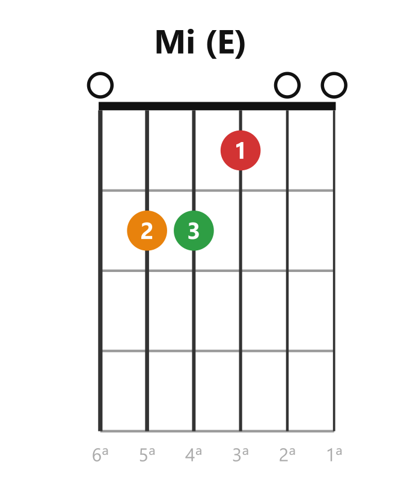
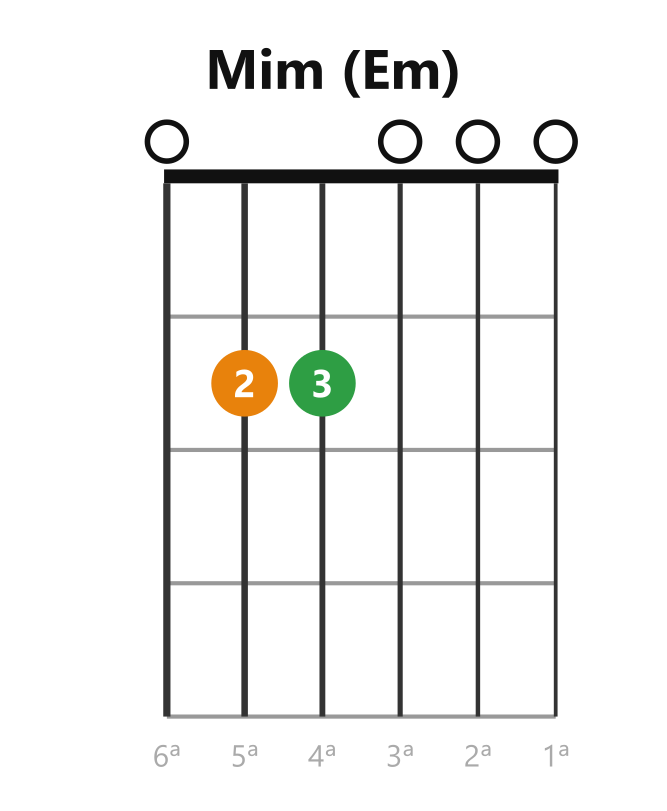

# 🎵 El acorde: varias notas que suenan bien juntas

> **Un acorde es tocar tres o más notas al mismo tiempo, elegidas para que suenen bien juntas.** Es la unidad con la que se acompañan las canciones: cuando escuchas la guitarra "rellenando" debajo de una voz en un worship, eso son acordes.

Una nota sola suena fina, sola. Junta tres bien elegidas y aparece **cuerpo, emoción, color**. En la guitarra, una forma de la mano izquierda + un rasgueo = las 3-4 notas del acorde sonando a la vez (aunque pises 3 cuerdas y suenen 5 o 6: las de al aire también son notas del acorde).

## Mayor y menor: los dos colores

Todo acorde de los que usas ahora es de una de dos familias, y la diferencia se **oye** antes de entenderse:

| Familia   | Cómo suena                             | Se escribe                            |
| --------- | --------------------------------------- | ------------------------------------- |
| **Mayor** | Estable, completo, "alegre" — luz      | Solo el nombre:**C**, **G**, **D**    |
| **Menor** | Melancólico, emotivo — sombra cálida | Nombre +**m**: **Am**, **Em**, **Dm** |

La diferencia física es mínima —**una sola nota** del acorde baja un poquito— y cambia todo el color. El menor no es "peor": es la herramienta de la emoción. Las canciones que tocan el corazón usan los dos: el mayor da firmeza, el menor da el nudo en la garganta.

## ⚠️ La trampa del vocabulario: "mayor" es el apellido por defecto

Parece que hubiera tres cosas — "acordes", "acordes mayores" y "acordes menores" — pero no: **hay acordes, y cada uno es mayor o menor.** Lo confuso es la escritura:

> **Un acorde dicho "a secas" es mayor.** "C" o "Do" = Do **mayor** — el "mayor" no se escribe porque es el apellido por defecto. Lo menor siempre se marca: la **m** de Am.

Así, en la lista de la academia: **C, D, E, G, A** son mayores (a secas) y **Em, Dm, Am** son menores (llevan la m).

## Un acorde puede vivir dentro de otro

Dos sentidos, ambos reales:

**1. En los dedos.** Algunas formas contienen otras completas. El caso perfecto de los 8: forma **Mi (E)** y levanta solo el dedo 1 — lo que queda es **Mim (Em)**, un acorde entero.

|  |  |
| :--------------------------: | :-----------------------------: |
|  *Mi (E) — con el dedo 1*  | *Levanta el dedo 1 → Mim (Em)* |

Y el detalle instructivo: la nota que quitas al levantar ese dedo es **exactamente la que separa mayor de menor** — la sección anterior, vista en los dedos.

**2. En las notas.** Un acorde con más notas contiene acordes simples adentro: **Am7** (La-Do-Mi-Sol) trae dentro al **Do** (Do-Mi-Sol) *y* al **Lam** (La-Do-Mi) a la vez. Por eso ciertos acordes suenan emparentados. Esto se vuelve herramienta con las séptimas (M5).

Ambos sentidos siguen la regla de siempre: **el acorde son sus notas** — si dentro de un grupo de notas está completo el grupo de otro acorde, ese acorde está ahí adentro.

> 📋 **Repaso en una pantalla**
>
> - **Acorde** = 3+ notas a la vez que suenan bien juntas. La base del acompañamiento.
> - **Mayor** = estable/alegre, se escribe a secas (C, G, D, E, A). **Menor** = emotivo, lleva **m** (Am, Em, Dm).
> - **No hay tres categorías:** todo acorde es mayor o menor; "mayor" es el apellido que no se escribe.
> - La diferencia física es una sola nota; la diferencia emocional es todo.
> - **Un acorde puede vivir dentro de otro:** en los dedos (Mi − dedo 1 = Mim) y en las notas (Am7 contiene a Do y a Lam). El acorde son sus notas.

---

[[00_indice|índice]] · [[clase02_diagramas-de-acorde|siguiente → Cómo se lee un diagrama]]
