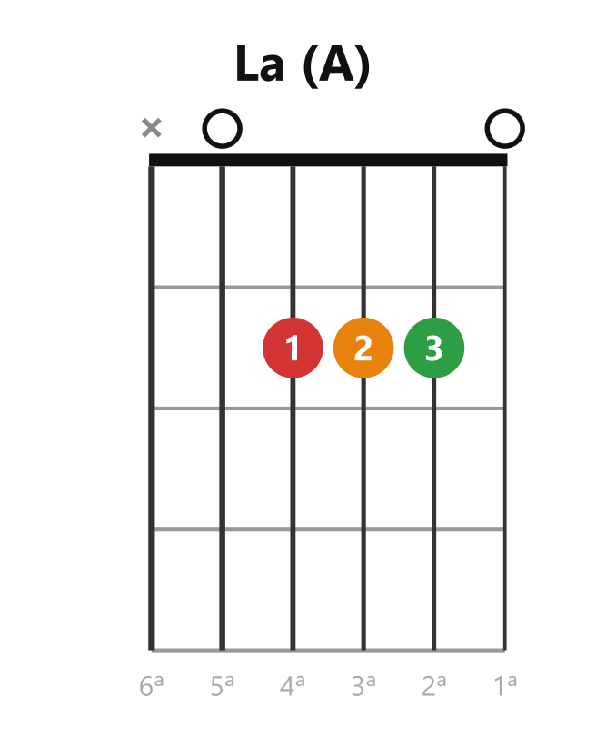
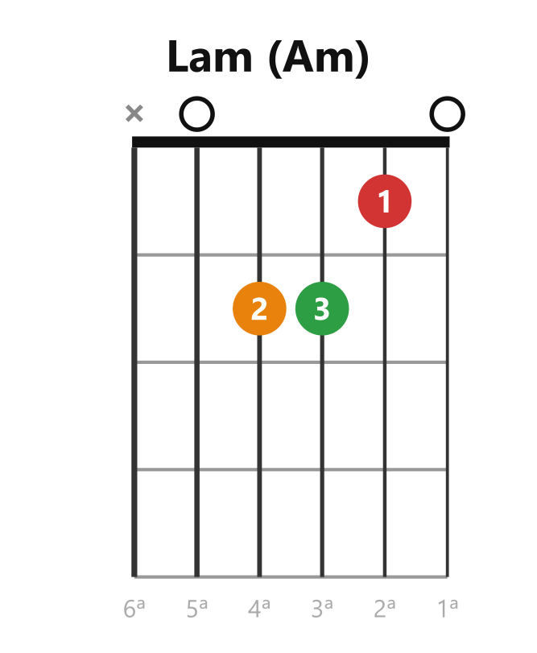
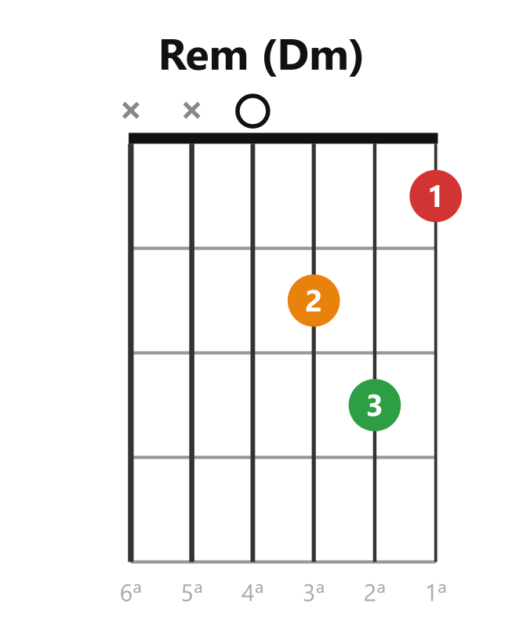

# 🎸 Los 8 acordes abiertos del arranque

> **Estas son las formas. Se estudian AQUÍ y se verifican aquí — nunca mirándolas mientras practicas.** El objetivo es producirlas de memoria al oír su nombre; para eso está el drill de Anki (`sistema/herramientas/anki-acordes/`), donde estos mismos diagramas son el reverso de verificación.
>
> 🖨️ **Versión imprimible:** los 8 en una sola hoja A4 apaisada → `img/hoja-8-acordes.png` (imprimir con "ajustar a página"). Misma regla: se mira para verificar, no mientras se toca.

## Mayores

| | | |
|:-:|:-:|:-:|
|  |  |  |
|  |  | |

## Menores

| | | |
|:-:|:-:|:-:|
|  |  |  |

## Las anclas: qué se queda quieto entre acordes

El secreto de los cambios rápidos no es mover los dedos más rápido — es **mover menos dedos**. Entre muchos pares de acordes hay dedos que no necesitan moverse (anclas) o formas que se repiten. Las de estos 8:

| Cambio | Qué se queda quieto |
|---|---|
| **Am ↔ C** | Los dedos **1 y 2** no se mueven — solo viaja el 3 |
| **Em ↔ E** | Los dedos **2 y 3** no se mueven — solo entra/sale el 1 |
| **Am ↔ E** | **La misma forma**, corrida una cuerda (los tres dedos viajan juntos, en bloque) |
| **D ↔ Dm** | El dedo **3** (2ª cuerda, traste 3) no se mueve |

Antes de tocar una progresión nueva, **busca el ancla de cada cambio**. Cambiar con ancla es la diferencia entre "recolocar la mano" y "ajustar dos dedos".

## Notas de forma (lo que suele costar de cada uno)

- **C (Do):** el estirón del dedo 3 hasta la 5ª cuerda. Es el que más práctica pide de los 8.
- **G (Sol):** cuatro dedos, pero cómodos — el 3 y el 4 caen juntos en las agudas.
- **D (Re) y Dm (Rem):** solo se rasguean **4 cuerdas** (las dos gruesas llevan ✕) — el rasgueo se vuelve más corto y preciso.
- **E (Mi) y Em (Mim):** suenan las 6 cuerdas. Los más llenos y los más fáciles.
- **A (La):** tres dedos apretados en el mismo traste — si no caben, prueba acomodarlos en diagonal.
- **Am (Lam):** la forma de E corrida una cuerda hacia abajo.

> 📋 **Repaso en una pantalla**
> - **5 mayores:** C · D · E · G · A — **3 menores:** Em · Am · Dm.
> - El cambio rápido = **mover menos dedos**, no moverlos más rápido. Anclas: Am↔C (queda 1-2) · Em↔E (queda 2-3) · Am↔E (forma en bloque) · D↔Dm (queda el 3).
> - Las formas se estudian aquí y en Anki; **se producen de memoria** en la práctica.

---
[[clase02_diagramas-de-acorde|← El diagrama]] · [[00_indice|índice]] · su práctica: [[clase02_practica_progresiones]]
