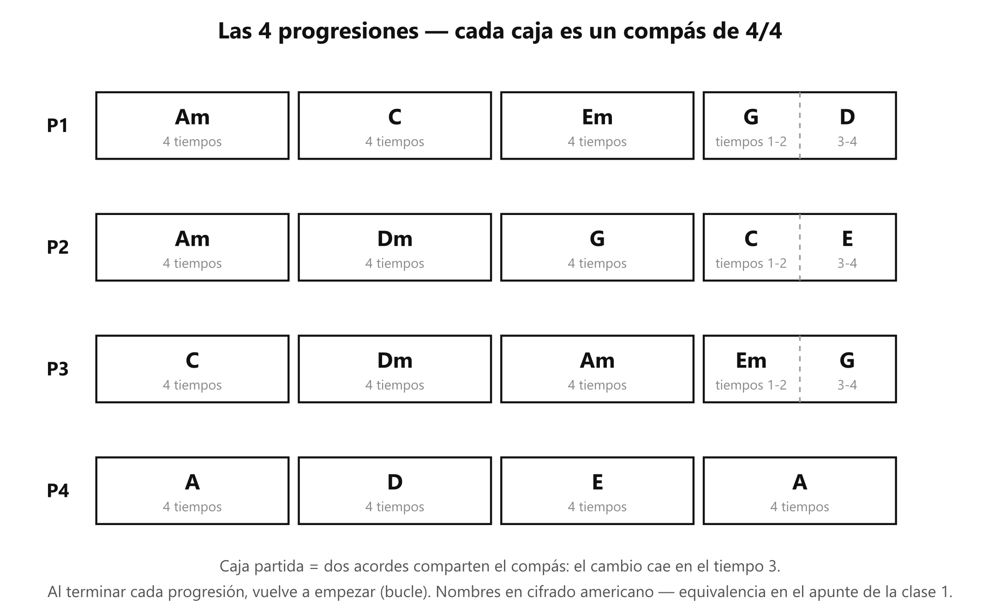

# 🎸 Práctica — Las 4 progresiones (el cambio de acorde)

> **Con la guitarra afinada.** Es la tarea de la clase 2. Una **progresión** es una secuencia de acordes que se repite en bucle — y es, literalmente, de lo que están hechas las canciones: dominar estas cuatro es ensayar el esqueleto de todo lo que vas a tocar.

## 🎯 Qué estás mejorando (en claro)

**La velocidad y limpieza del CAMBIO de acorde** — no los acordes sueltos, sino el viaje entre ellos, que es donde los principiantes se atascan y donde las canciones se caen. Concretamente: mover la menor cantidad de dedos (anclas), no despegar toda la mano, y que los dedos del acorde caigan todos a la vez.

**Lo vas a notar** cuando el cambio deje de hacer "hueco" en tu conteo: hoy entre acorde y acorde hay un silencio de búsqueda; en unas semanas el siguiente acorde cae en su tiempo, y eso — exactamente eso — es sonar a canción.

## El gráfico

*Cada caja es un compás. Caja partida: el cambio cae en el tiempo 3.*

## Cómo se hace (referencia)

- **Una vuelta** = la progresión completa, de inicio a fin, y regresas al primer acorde.
- **Modo A — un rasgueo por compás:** rasgueo hacia abajo en el "1", sostienes 2-3-4 mientras preparas el cambio. En caja partida: rasgueo en el 1 **y** en el 3.
- **Modo B — un rasgueo por tiempo:** cuatro rasgueos abajo por compás, contando en voz alta. En caja partida: dos y dos.
- **Antes de tocar una progresión: busca el ancla de cada cambio** (tabla en [[clase02_los-8-acordes]]). Es la mitad del ejercicio.
- **Los 4 niveles de velocidad:** ① sin metrónomo → ② 60 BPM → ③ 70 → ④ 80. **Cada progresión está en un nivel, y avanza por su cuenta** (la P4 puede ir en 60 mientras la P2 sigue sin metrónomo). Una progresión **pasa al siguiente nivel** cuando da **2 vueltas seguidas limpias, sin frenar en ningún cambio**, en su nivel actual. Nunca se salta un nivel. Marca aquí dónde va cada una:

| Progresión | ① Sin metrónomo | ② 60 | ③ 70 | ④ 80 |
| ----------- | :---------------: | :---: | :---: | :---: |
| P1          |                  |      |      |      |
| P2          |                  |      |      |      |
| P3          |                  |      |      |      |
| P4          |                  |      |      |      |

## ⏱️ Los 3 niveles del día — elige según cómo amaneciste

**Pon cronómetro. Cuando suena, paras.** Cada nivel incluye al anterior.

### 🔵 Mínimo — 6 min (día sin ganas; hecho esto, CUMPLISTE)

| Qué                                                         | Cuánto            |
| ------------------------------------------------------------ | ------------------ |
| P4 (A-D-E-A), modo A                                         | 3 vueltas (~2 min) |
| P1, modo A                                                   | 2 vueltas (~3 min) |
| Cambios fantasma del par que más te trabó (ver Afinación) | 5 saltos (~1 min)  |

Sin metrónomo.

### 🟢 Natural — 14 min (el día normal)

Todo el Mínimo, y además:

| Qué                          | Cuánto              |
| ----------------------------- | -------------------- |
| P2, modo A                    | 2 vueltas (~2.5 min) |
| P3, modo A                    | 2 vueltas (~2.5 min) |
| **P1, modo B, metrónomo 60** | 3 vueltas (~3 min)   |

### 🔥 Motivado — 20 min

Todo el Natural, y además:

| Qué                                                                                              | Cuánto               |
| ------------------------------------------------------------------------------------------------- | --------------------- |
| P2, P3 y P4 en modo B a 60                                                                        | 1 vuelta c/u (~4 min) |
| La progresión que ya dio 2 vueltas limpias a 60 →**súbela a 70** (y a 80 solo desde 70 limpio) | ~2 min                |

## Cómo suena cuando está bien

- El siguiente acorde **cae en su tiempo** — el conteo no se detiene a esperarte.
- Cada acorde cae **de una** (los dedos aterrizan juntos), no dedo por dedo.
- En caja partida, el segundo acorde entra justo en el "3".

## Si sale mal — los 3 típicos

| Pasa esto                              | Casi siempre es                           | Arréglalo así                                                                                                  |
| -------------------------------------- | ----------------------------------------- | ---------------------------------------------------------------------------------------------------------------- |
| **Hueco largo en un cambio**           | Ese par específico no está automatizado | Aísla SOLO ese par y hazlo 5 veces seguido — no repitas toda la vuelta (eso practica mil veces lo que ya sale) |
| **Levantas toda la mano al cambiar**   | No buscaste el ancla                      | Antes de tocar, di en voz alta qué dedo(s) se quedan en ese cambio. Si hay ancla, que no se despegue            |
| **El acorde cae sucio, dedo por dedo** | Estás armando la forma en el aire        | Piensa la forma completa antes de saltar y baja los dedos**todos a la vez**                                      |
