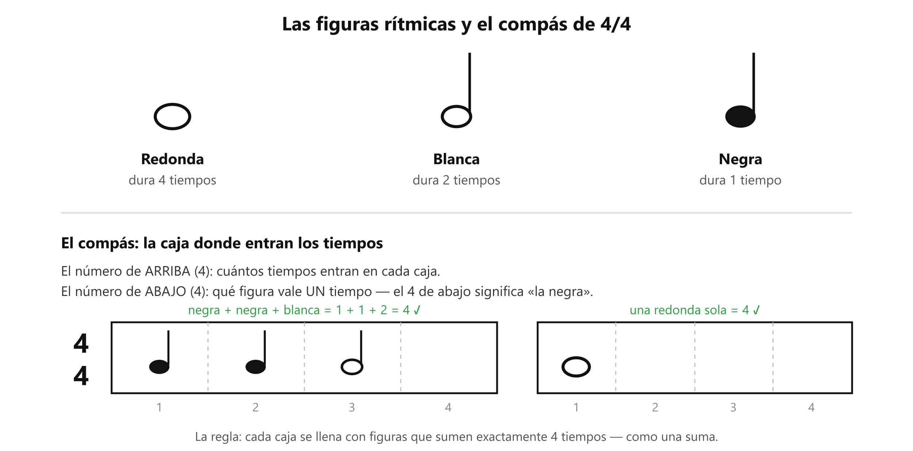

# 🥁 Ritmo básico: el pulso, las figuras y la caja del 4/4

> **El ritmo es cuándo suena cada nota. Su corazón es el pulso: un "tic" parejo que no se acelera ni se frena** — lo que marcas con el pie cuando te gusta una canción. El metrónomo es una máquina que hace ese tic por ti mientras aprendes a llevarlo por dentro.

## Las figuras: cuánto dura cada nota

Una **figura rítmica** es el símbolo que dice cuánto dura una nota. En la clase viste tres:

| Figura | Dura |
|---|---|
| **Redonda** (bolita hueca, sin palito) | **4 tiempos** |
| **Blanca** (bolita hueca con palito) | **2 tiempos** |
| **Negra** (bolita rellena con palito) | **1 tiempo** |

Cada una dura **la mitad** de la anterior. Un "tiempo" = un clic del metrónomo.

*Arriba las figuras; abajo la caja del compás llenándose — como una suma.*

## El compás: la caja — y qué significa el 4/4

El **compás** es una **caja de tiempo**: la música se corta en cajas iguales y cada caja se llena con figuras. Los dos números del **4/4** dicen cómo es la caja:

- **El de ARRIBA** → **cuántos tiempos entran en cada caja.** Aquí: 4.
- **El de ABAJO** → **qué figura vale UN tiempo.** El 4 de abajo es un código que significa "**la negra**".

O sea, 4/4 se lee: *"cajas de 4 tiempos, y cada negra ocupa uno"*. Y el llenado funciona como matemática: cada caja debe sumar **exactamente 4** — una redonda sola (4), o dos blancas (2+2), o cuatro negras (1+1+1+1), o mezclas (negra + negra + blanca = 4).

**El "1" es el tiempo fuerte** — el que más se siente, donde suelen caer los cambios. Se cuenta en voz alta: *1-2-3-4, 1-2-3-4…*

*(¿Por qué existe el número de abajo, si podría ser siempre la negra? Porque hay compases que cuentan con otra figura — los verás más adelante, p. ej. el 6/8 de mucho worship lento. Por ahora: 4 abajo = negra, y punto.)*

## El tempo: la velocidad de la canción

El **tempo** es cuántos pulsos entran en un minuto. Se mide en **BPM** (*beats per minute* — pulsos por minuto).

- **60 BPM** = 60 pulsos por minuto = **un pulso por segundo**. Por eso es el tempo de práctica: cómodo y parejo.
- Número más alto = pulsos más seguidos = más rápido (120 = dos por segundo). Más bajo = más lento.
- Cuando una práctica dice "sube a 70", pide exactamente eso: el mismo ejercicio, pulsos un poco más seguidos.

### Cada canción tiene su tempo

| Canción | Tempo | Cómo se siente |
|---|---|---|
| I'd Come For You — Nickelback | ~74 BPM | Lenta, balada |
| Eres — Un Corazón | ~105 BPM | Tranquila |
| Renuévame — Marcos Witt | ~111 BPM | Media |
| No hay lugar más alto — Miel San Marcos | ~136 BPM | Pulso rápido… y aun así se siente lenta |
| Capitán — TWICE | ~143 BPM | Rápida de verdad |

### Tempo no es dificultad — lo que el número no dice

El BPM dice **qué tan seguido late** la canción. No dice **cuánto trabaja tu mano entre latido y latido** — y eso es lo que de verdad la hace fácil o difícil:

- *No hay lugar más alto* va a ~136 BPM y se siente lenta: sus **acordes duran compases enteros**, la mano casi no cambia aunque el pulso corra.
- *Capitán* va a ~143 BPM y sí es exigente: la mano derecha trabaja **denso en cada pulso**.

> **Regla de dos líneas:** tempo = qué tan rápido late la canción · dificultad = cuánto haces tú entre latido y latido. Por eso el repertorio se ordena por lo segundo, no por el número.

## El metrónomo — andamio, no muleta

Regla del sistema: el metrónomo se usa para **calibrar** tu pulso, y luego se suelta. Contar **en voz alta** mientras tocas hace lo contrario que la vieja "pista que cae": te instala el reloj **por dentro**, en vez de prestártelo desde afuera.

> 📋 **Repaso en una pantalla**
> - **Pulso** = el tic parejo. **Metrónomo** = la máquina del tic (se calibra y se suelta).
> - **Tempo** = velocidad del pulso, en **BPM** (pulsos por minuto). 60 = uno por segundo. Cada canción tiene el suyo.
> - **Tempo alto ≠ difícil.** La dificultad es cuánto haces tú entre latido y latido, no qué tan rápido late.
> - **Redonda 4 · Blanca 2 · Negra 1.** Cada una, la mitad de la anterior.
> - **4/4:** arriba = 4 tiempos por caja; abajo = la negra vale 1 tiempo. Cada caja suma exactamente 4.
> - El **"1"** es el tiempo fuerte. Contar en voz alta: 1-2-3-4.

---
[[00_indice|índice]] · su práctica: [[clase01_practica_ritmo-metronomo]]
